# Операционные системы UNIX/Linux (Базовый)

- [Операционные системы UNIX/Linux (Базовый)](#операционные-системы-unixlinux-базовый)
  - [Установка ОС](#установка-ос)
  - [Создание пользователя](#создание-пользователя)
  - [Настройки сети ОС](#настройки-сети-ос)
  - [Обновление ОС](#обновление-ос)
  - [Использование команды sudo](#использование-команды-sudo)
  - [Установка и настройка службы времени](#установка-и-настройка-службы-времени)
  - [Установка и использование текстовых редакторов](#установка-и-использование-текстовых-редакторов)
    - [NANO](#nano)
    - [VIM](#vim)
    - [MCEDIT](#mcedit)
  - [Установка и базовая настройка сервиса SSHD](#установка-и-базовая-настройка-сервиса-sshd)
  - [Установка и использование утилит top, htop](#установка-и-использование-утилит-top-htop)
    - [SORT BY PID](#sort-by-pid)
    - [SORT BY PERCENT\_CPU](#sort-by-percent_cpu)
    - [SORT BY PERCENT\_MEM](#sort-by-percent_mem)
    - [SORT BY TIME](#sort-by-time)
    - [FILTER 'sshd'](#filter-sshd)
    - [SEARCH 'syslog'](#search-syslog)
    - [C добавленным выводом hostname, clock и uptime](#c-добавленным-выводом-hostname-clock-и-uptime)
  - [Использование утилиты fdisk](#использование-утилиты-fdisk)
  - [Использование утилиты df](#использование-утилиты-df)
  - [Использование утилиты du](#использование-утилиты-du)
  - [Установка и использование утилиты ncdu](#установка-и-использование-утилиты-ncdu)
    - [`/home` and `/var`](#home-and-var)
    - [`/var/log`](#varlog)
  - [Работа с системными журналами](#работа-с-системными-журналами)
  - [Использование планировщика заданий CRON](#использование-планировщика-заданий-cron)

## [Установка ОС](#установка-ос)

Шаги предоврительной установки и настройки пропущены
<br>
Узнать версию установленной ОС
``` bash
$ cat /etc/issue
```

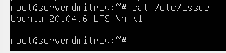

## [Создание пользователя](#создание-пользователя)

Для того чтобы создать нового пользователя введите следующую команду. 
``` bash
$ sudo adduser -G adm user-1
$ cat /etc/passwd | grep user-1
$ sudo passwd user-1
```
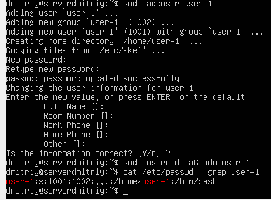

## Настройки сети ОС

1. Устанавливаем новое имя машины.<br>
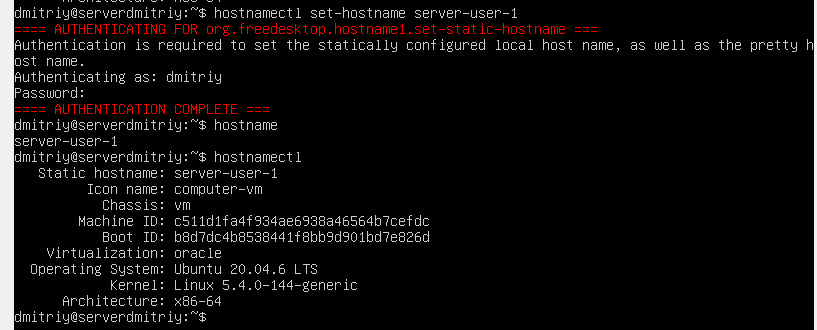

2. Устанавливаем временную зону (она уже была правильной)
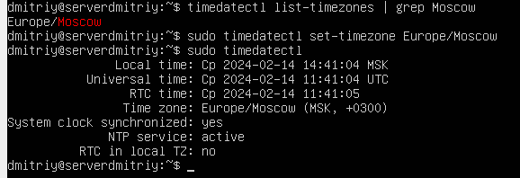
3. Вывести названия сетевых интерфейсов с помощью консольной команды.
Для этого надо установить набор сетевых инструментов.
``` bash
$ sudo apt install net-tools
```

Текущие подключения
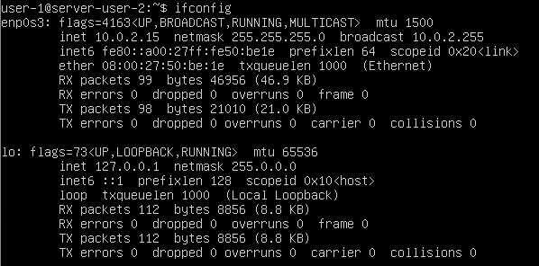

> `lo` или `local loopback` (локальная петля) – виртуальный интерфейс, присутствующий по умолчанию в любом Linux. Он используется для отладки сетевых программ и запуска серверных приложений на локальной машине. С этим интерфейсом всегда связан адрес 127.0.0.1. У него есть dns-имя – localhost.
4. IP-адрес устройства на котором я работаю
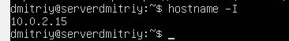
> Dynamic Host Configuration Protocol (DHCP) — автоматический предоставляет IP адреса и прочие настройки сети (маску сети, шлюз и т.п) компьютерам и различным устройствам в сети.
5. Определить и вывести на экран внешний ip-адрес шлюза (ip) и внутренний IP-адрес шлюза, он же ip-адрес по умолчанию (gw).
> Так мы можем определить наш внешний ip-адрес шлюза (ip):
``` bash
$ wget -O - -q icanhazip.com
$ curl ifconfig.me/ip
```

> Так мы можем определить наш внутренний IP-адрес шлюза:
``` bash 
$ ip route
```
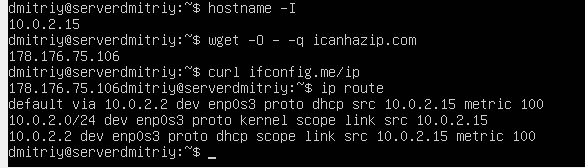

6. Задать статичные (заданные вручную, а не полученные от DHCP сервера) настройки ip, gw, dns (использовать публичный DNS серверы, например 1.1.1.1 или 8.8.8.8).
``` bash
$ sudo nano /etc/netplan/00-installer-config.yaml
```
> До:

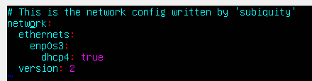

 > Изменили файл /etc/netplan/00-installer-config.yaml, применили изменения в netplan, перезагрузили машину.
``` bash
$ sudo netplan apply
$ reboot
```

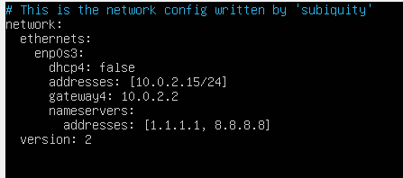

> Проверяем, что адреса соотсветствуют заданным в предыдущем пункте.
``` bash
$ ifconfig
```

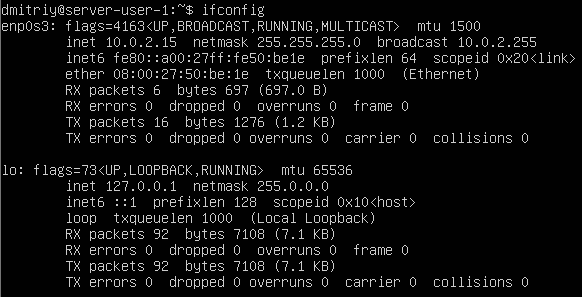

> Проверяем успешноли пропингуются удаленные хосты 1.1.1.1 и ya.ru
``` bash
$ ping 1.1.1.1
$ ping ya.ru
```

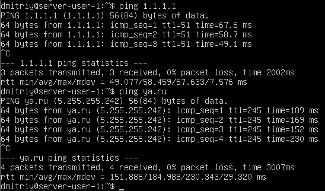

## Обновление ОС

> Обновить системные пакеты до последней на момент выполнения задания версии.

``` bash
$ sudo apt update
```
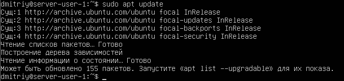

## Использование команды sudo 

> Разрешить пользователю, созданному в [Part 2](#создание-нового-пользователя), выполнять команду sudo. <br>
`sudo` — это утилита, предоставляющая привилегии root для выполнения административных операций в соответствии со своими настройками. Она позволяет легко контролировать доступ к важным приложениям в системе. По умолчанию, при установке Ubuntu первому пользователю (тому, который создаётся во время установки) предоставляются полные права на использование sudo. Т.е. фактически первый пользователь обладает той же свободой действий, что и root.

``` bash
$ sudo usermod -aG sudo user-1
$ su user-1
$ cat /etc/hostname
$ sudo hostname server-user-2
$ su user-1
```

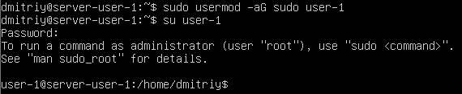
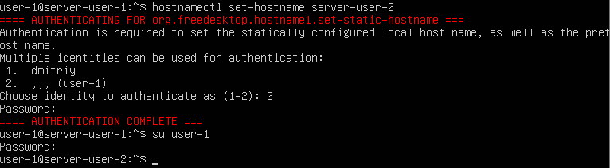

## Установка и настройка службы времени

Служба автоматической синхронизации времени уже была настроена
``` bash
$ sudo timedatectl
$ timdatectl show
```

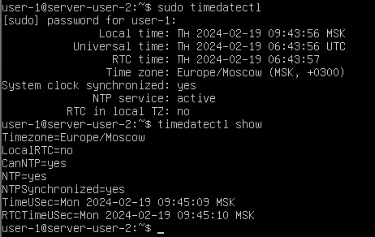

## Установка и использование текстовых редакторов

1. Установить текстовые редакторы VIM (+ любые два по желанию NANO, MCEDIT, JOE и т.д.)
``` bash 
$ sudo apt install vim
$ sudo apt install nano
$ sudo apt install mcedit
```

2. Используя каждый из трех выбранных редакторов, создайте файл `test_X.txt`, где `X` -- название редактора, в котором создан файл. Напишите в нём свой никнейм, закройте файл с сохранением изменений.
3. Используя каждый из трех выбранных редакторов, откройте файл на редактирование, отредактируйте файл, заменив никнейм на строку "21 School 21", закройте файл без сохранения изменений.
4. Используя каждый из трех выбранных редакторов, отредактируйте файл ещё раз (по аналогии с предыдущим пунктом), а затем освойте функции поиска по содержимому файла (слово) и замены слова на любое другое.

### NANO

> nano test_nano.txt \
> Выход с сохранением: `CTRL + X`, затем `Y` и `ENTER` \
> Выход без сохранения: `CTRL + X`, затем `N` \
> Поиск: `CTRL + W`, <Что ищем> затем `ENTER`. \
> Для перехода к следующему совпадению `ALT + W`, для прекращения поиска `ALT + C`. \
> Замена: `CTRL + \` + `<ЧТО + ENTER>` + `<НА ЧТО + ENTER>` - `A` - ALL || `Y` - YES || `N` - NO

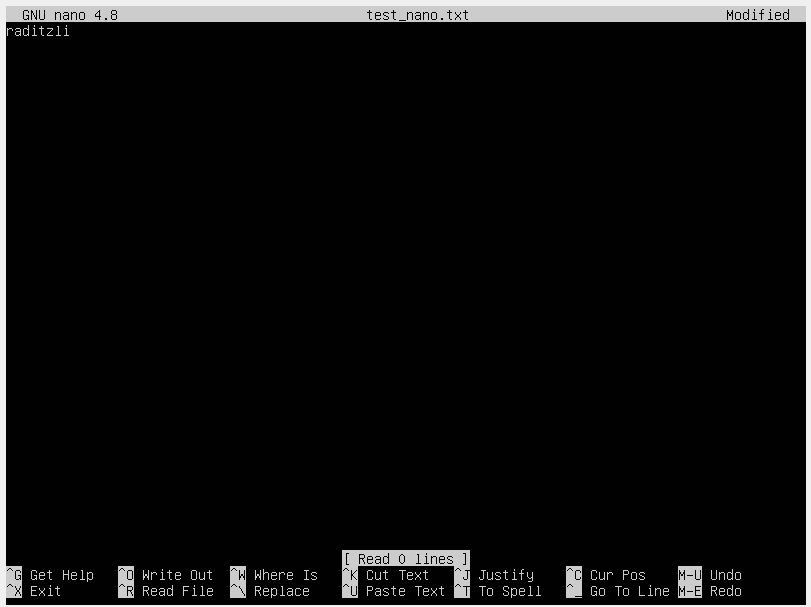
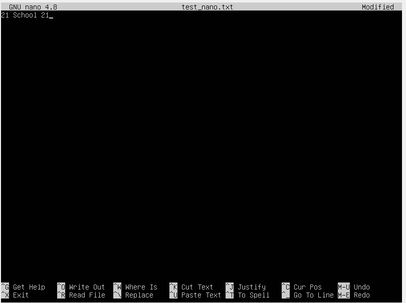
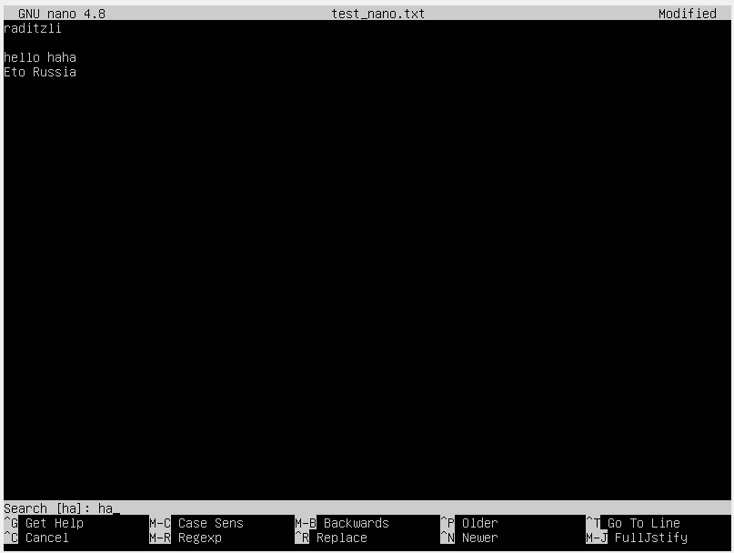

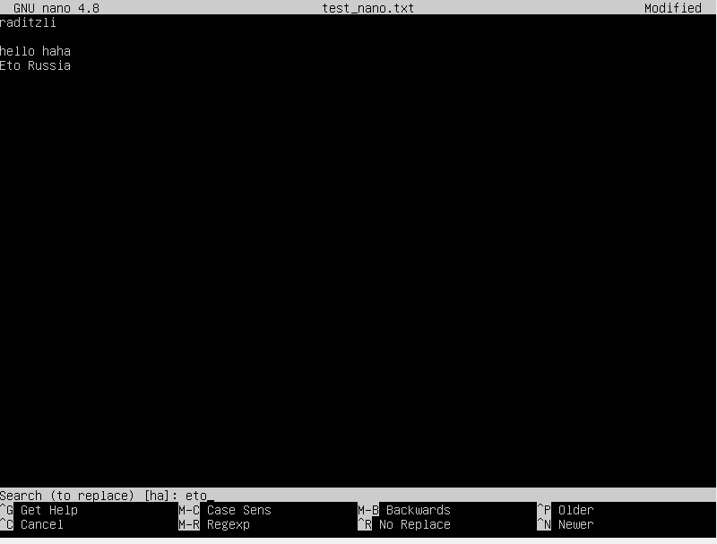
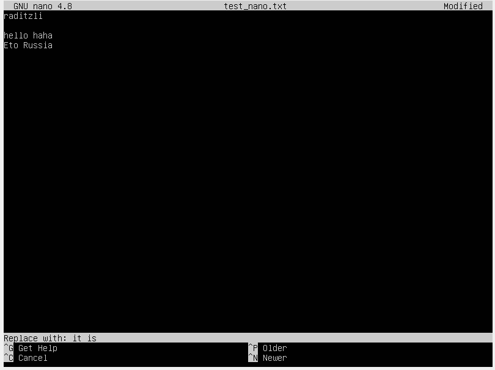
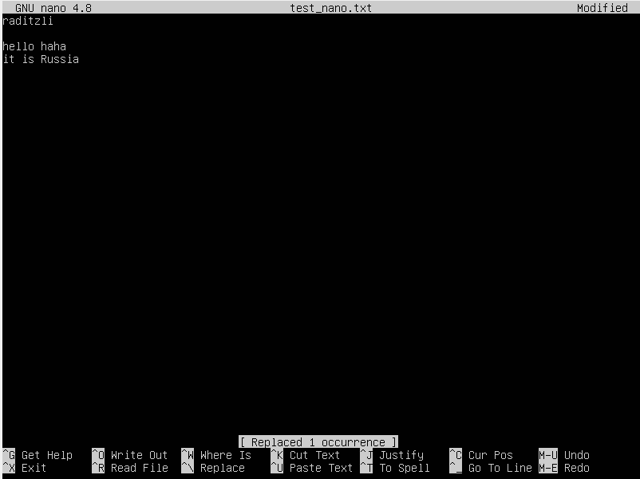

### VIM

> vim test_vim.txt \
> Режим редактирования `i` \
> Выйти из режима редактирования: `Esc` \
> Выход с сохранением: `:wq` \
> Выход без сохранения: `:q!`\
> Поиск: `/<Что хотим найти>` \
> Замена: `:s/<ЧТО>/<НА ЧТО>`


### MCEDIT

> mcedit test_mcedit.txt \
> Выход с сохранением: `F2 <YES> + F10` \
> Выход без сохранения: `F10 <NO>` \
> Поиск: `F7` + <Что ищем> + `<OK> || <FIND ALL>` \
> Замена: `F4` + <ЧТО> + <НА ЧТО> + `<REPLACE> || <ALL> || <SKIP>`


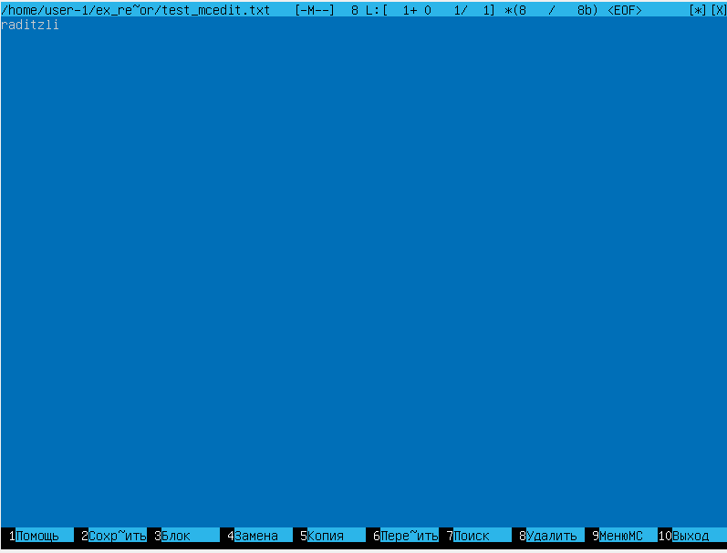
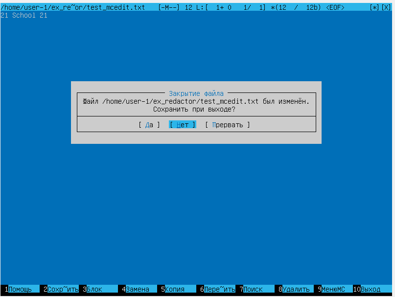
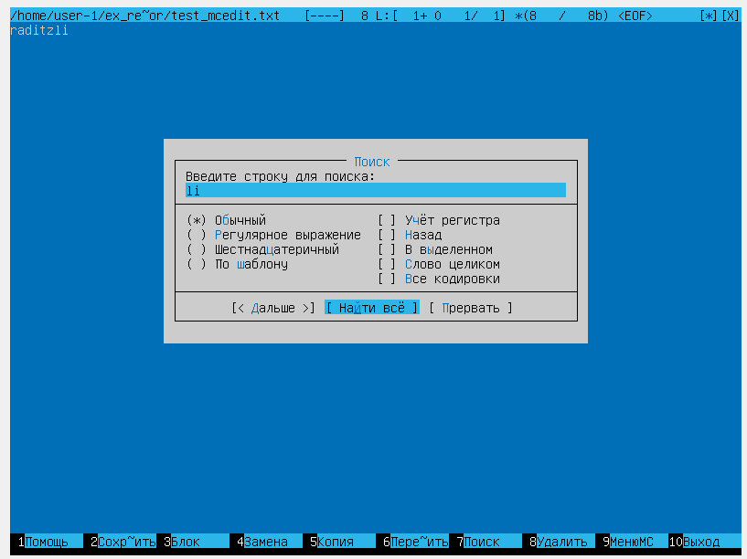
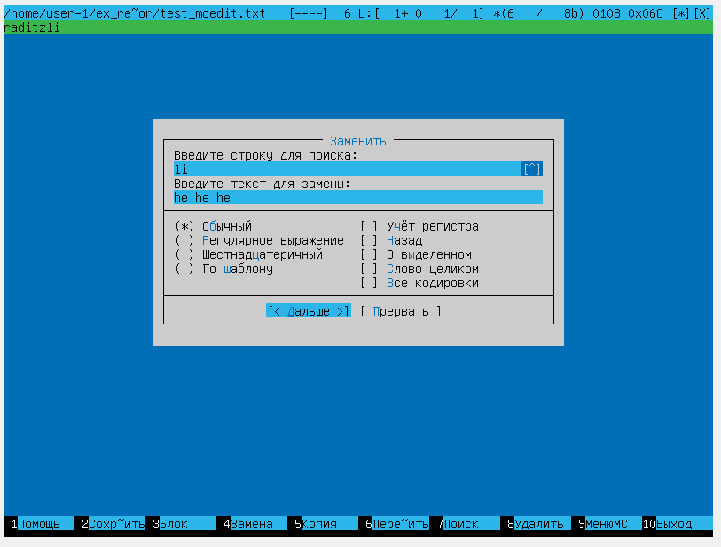
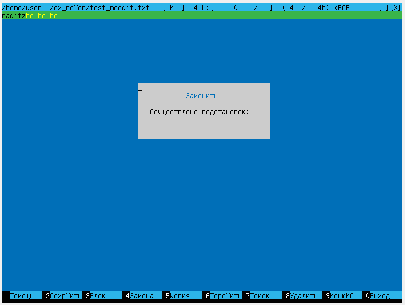

## Установка и базовая настройка сервиса SSHD

1. Установить службу SSHd.

``` bash
$ sudo apt-get install ssh
$ sudo apt install openssh-server
```
2. Добавить автостарт службы при загрузке системы.

``` bash
$ sudo systemctl enable ssh
$ systemctl status ssh
```
3. Перенастроить службу SSHd на порт 2022.
``` bash
$ sudo vim /etc/ssh/sshd_config
$ systemctl restart sshd
```
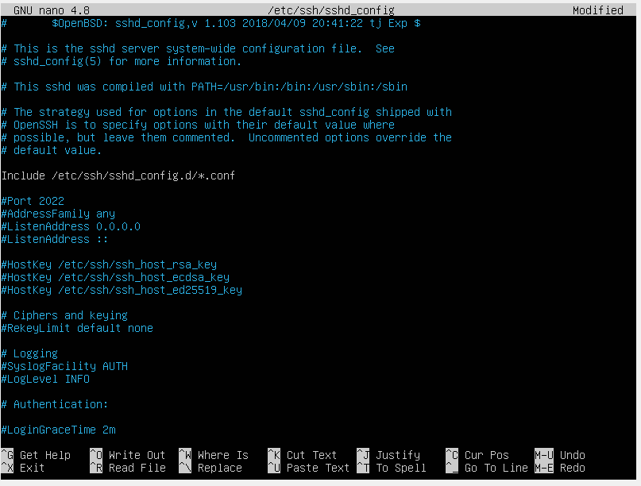

4. Используя команду ps, показать наличие процесса sshd. Для этого к команде нужно подобрать ключи.

- `ps` (показывает запущенные процессы, выполняемые пользователем в окне терминала);
- `ps -e` или `ps -A` (Чтобы просмотреть все запущенные процессы);
- `ps -d` (Чтобы показать все процессы, кроме лидеров сессии);
- `ps -d -N` (можно инвертировать вывод с помощью переключателя `-N`. Например, если хочу вывести только лидеров сеансов)
- `ps T` (увидеть только процессы, связанные с этим терминалом);
- `ps r` (просмотреть все работающие (`running`) процессы);
- `ps -p 'pid'` (если вы знаете идентификатор процесса PID, вы можете просто использовать следующую команду, для вывода процесса с этим `'pid'`);
- `ps -p 'pid1' 'pid2'`
- `ps U 'userlist'` (найти все процессы, выполняемые конкретным пользователем);
- `ps -ef` (получить полный список); 

``` bash 
$ ps -e | grep sshd
```
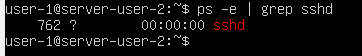

5. Перезагрузить систему.

``` bash
$ service ssh restart
$ reboot
$ netstat -tan 
```
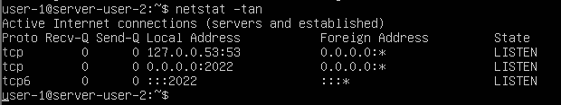

- `-t (--tcp)` отображает соедниеня только по tcp
- `-a (--all)` вывод всех активных подключений TCP
- `-n (--numeric)` вывод активных подключений TCP с отображением адресов и номеров портов в числовом формате
- `Proto:` Название протокола (протокол TCP или протокол UDP);
- `recv-Q:` очередь получения сети
- `send-Q:` Сетевая очередь отправки
- `Local Address` адрес локального компьтера и используемы номер порта
- `Foreign Address` адрес и номер удаленного компьтера к которомц подключен сокет
- `State` состояние сокетв
- `0.0.0.0` означает IP-адрес на локальной машине

## Установка и использование утилит top, htop

``` bash 
$ sudo apt install htop
$ htop
```

1. По выводу команды top определить и написать в отчёте:
* uptime - 18:41min;
* количество авторизованных пользователей - 1;
* общая загрузку системы - 0.00, 0.00, 0.00;
* общее количество процессов - 117;
* загрузку cpu - 1%;
* загрузку памяти - 170M/3920M;
* pid процесса занимающего больше всего памяти - 1316 (top -o %MEM);
* pid процесса, занимающего больше всего процессорного времени - 409 (top -o %CPU);

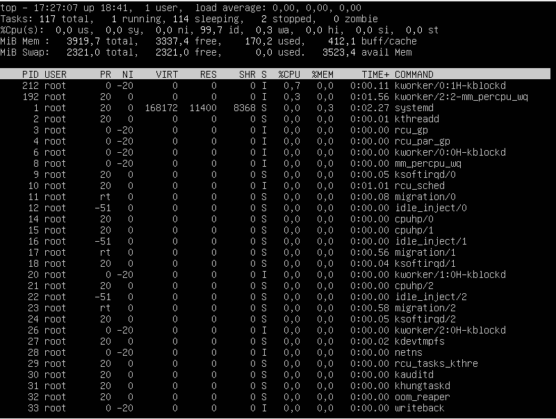

2. В отчёт вставить скрин с выводом команды htop:
отсортированному по `PID`, `PERCENT_CPU`, `PERCENT_MEM`, `TIME`.


### SORT BY PID
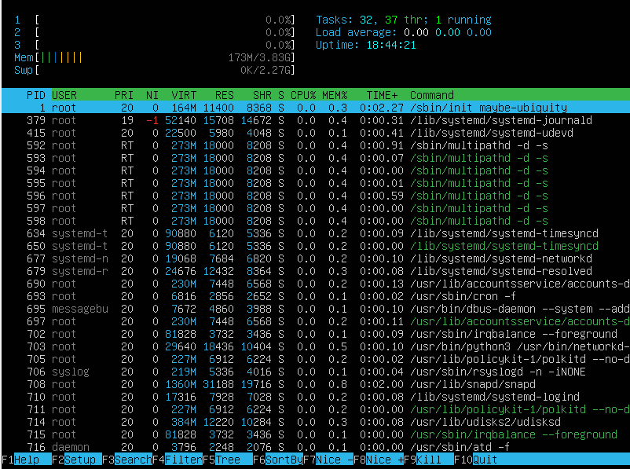
### SORT BY PERCENT_CPU
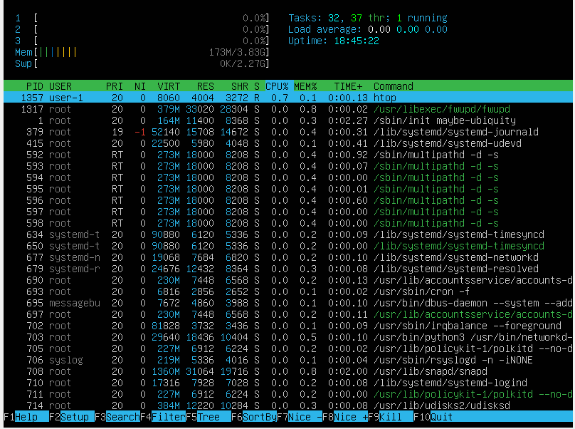
### SORT BY PERCENT_MEM
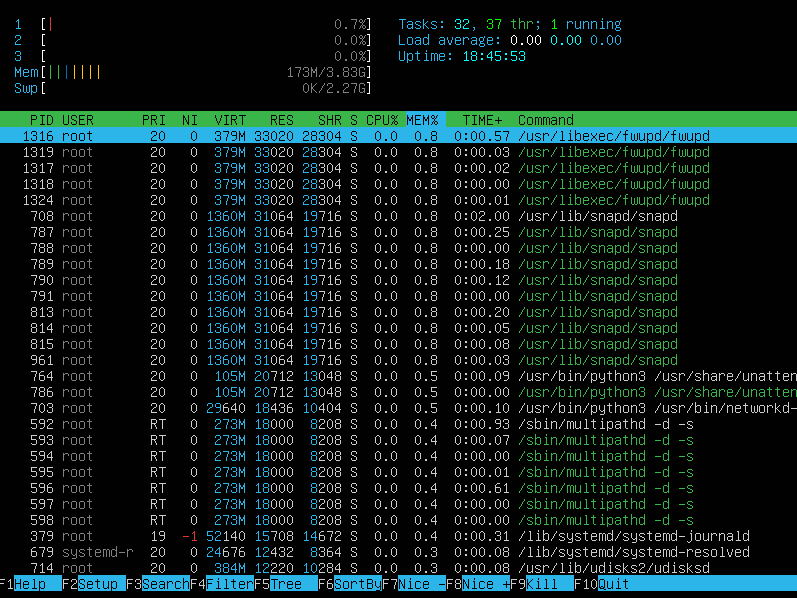
### SORT BY TIME
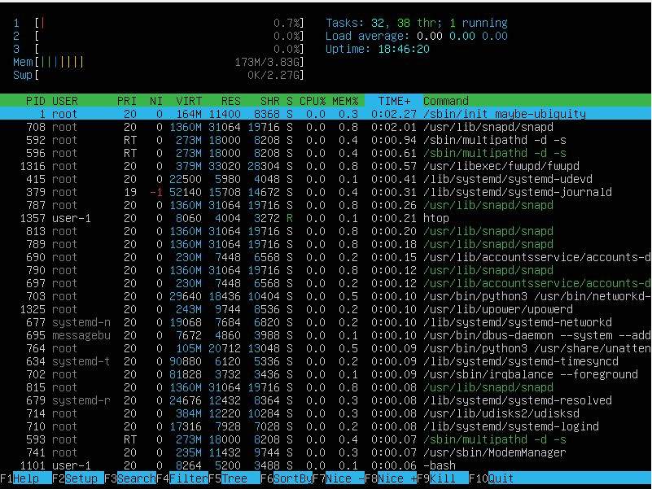
### FILTER 'sshd'
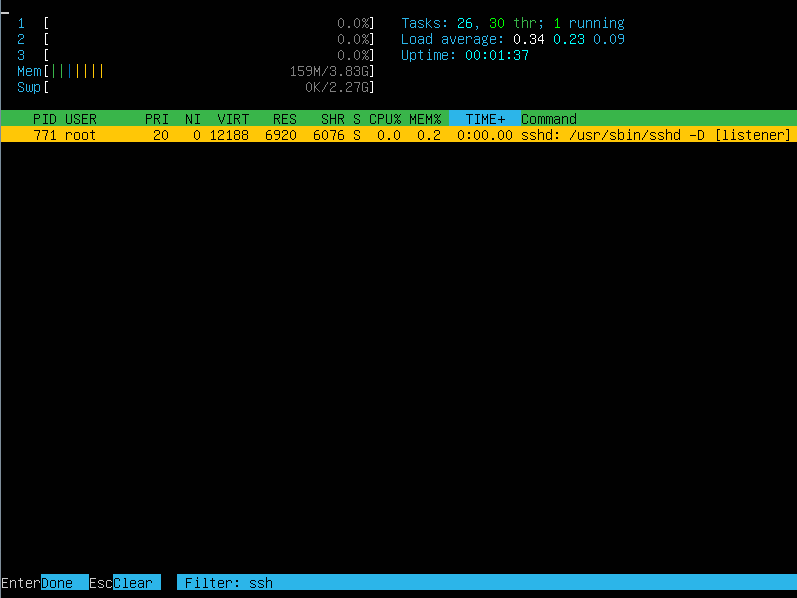
### SEARCH 'syslog'
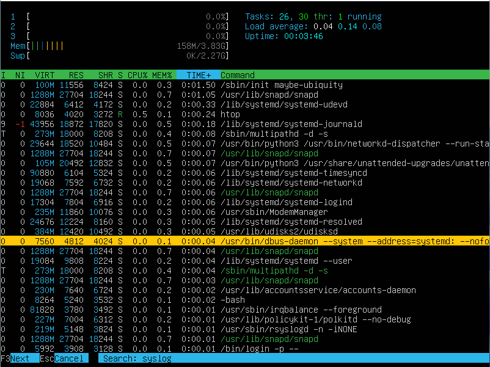
### C добавленным выводом hostname, clock и uptime
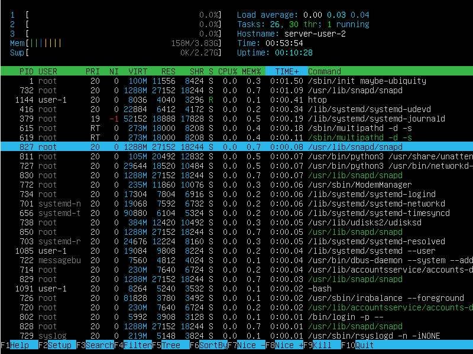


## Использование утилиты fdisk

``` bash 
$ sudo fdisk -l
$ sudo 
```
> Название диска: VBOX HARDDISK \
> Размер: 25 GiB \
> Количество секторов: 52428800 \
> Размер swap: 2G 

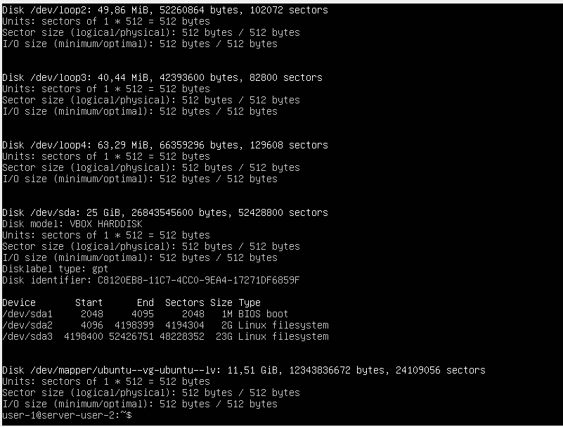

> Если у вас нет файла подкачки.
``` bash 
$ sudo fallocate -l 2G /swapfile
$ ls -lh /swapfile
$ sudo chmod 600 /swapfile
$ ls -lh /swapfile
$ sudo mkswap /swapfile
$ sudo swapon /swapfile
$ swapon --show || free -h
```
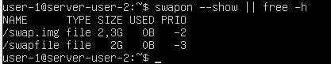

## Использование утилиты df

1. `df` для корневого раздела (/):
``` bash 
$ df
```
* Размер раздела - 11758760;
* Размер занятого пространства - 8757560;
* Размер свободного пространства - 2382092;
* Процент использования - 79%;
* Единица измерения в выводе - килобайт.

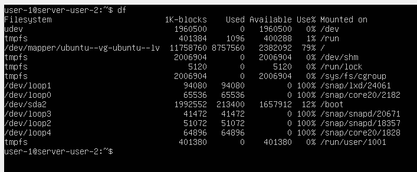

2. `df -Th` для корневого раздела (/):
``` bash 
$ df -Th
```
* Размер раздела - 12G;
* Рразмер занятого пространства - 8.4G;
* Размер свободного пространства - 2.3G;
* Процент использования - 79%
* Тип файловой системы для раздела - ext4.

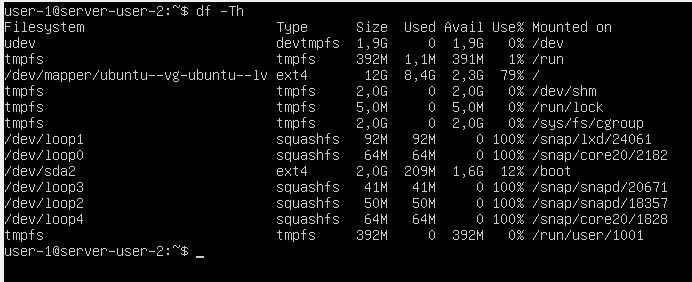

## Использование утилиты du
1. Вывести размер папок `/home`, `/var`, `/var/log` (в человекочитаемом виде)
``` bash 
$ sudo du -sh /var/log /var /home  
```
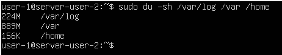

2. Вывести размер папок `/home`, `/var`, `/var/log` (в байтах) 
``` bash 
$ sudo du -s --block-size=1 /var/log /var /home  
```
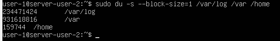

3. Вывести размер всего содержимого в `/var/log` (не общее, а каждого вложенного элемента, используя `*`)
``` bash 
$ sudo du -sh /var/log/*  
```
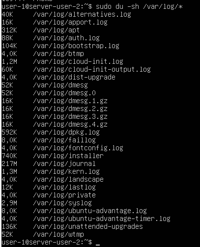

## Установка и использование утилиты ncdu

``` bash 
$ sudo apt install ncdu
$ sudo ncdu
```
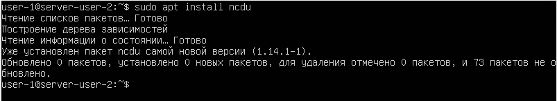

- Вывести размер папок `/home`, `/var`, `/var/log`.

### `/home` and `/var`
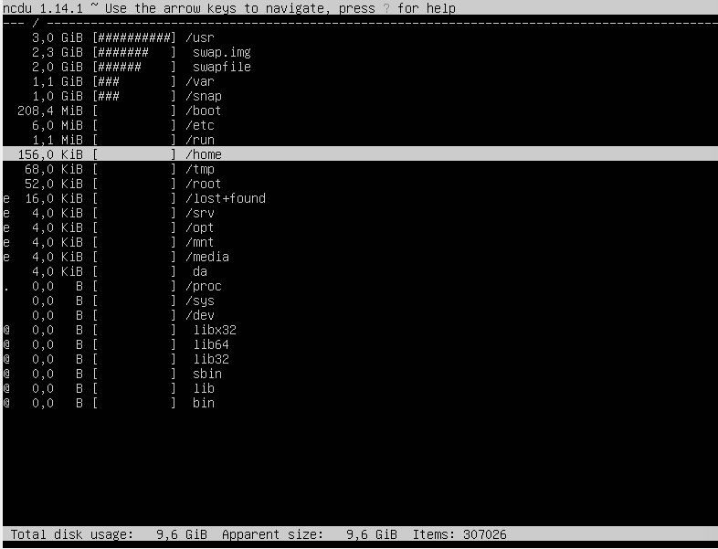
### `/var/log`
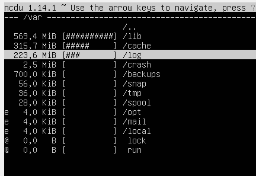

## Работа с системными журналами

1. 
``` bash 
$ sudo vim /var/log/dmesg
```
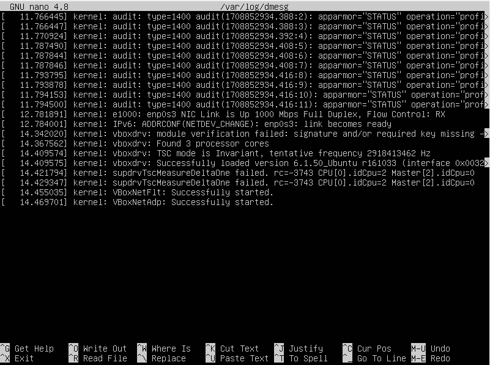

2. 
``` bash 
$ sudo vim /var/log/syslog
```
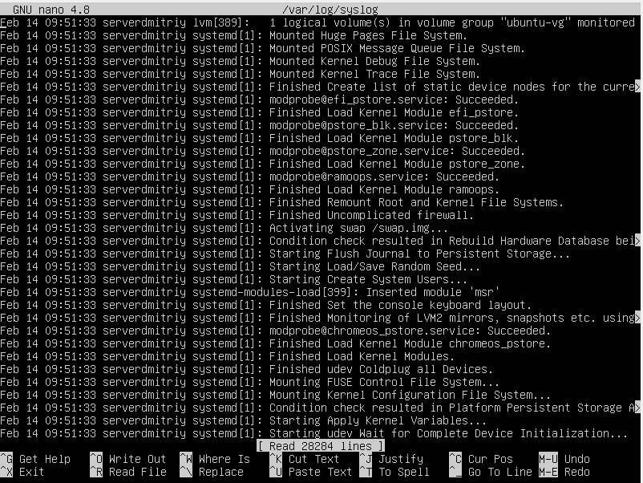

3.
``` bash 
$ sudo vim /var/log/auth.log
```
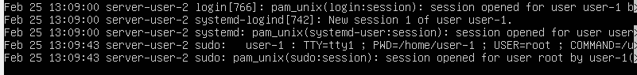

* Последняя успешная авторизация: Feb 25 13:09:00;
* Имя пользователя: user-1;
* Метод входа в систему: pam-unix.

4. `Перезапустить службу SSHd.`
``` bash 
$ sudo systemctl restart ssh
```
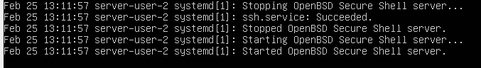

## Использование планировщика заданий CRON
``` bash 
$ sudo crontab -e
```
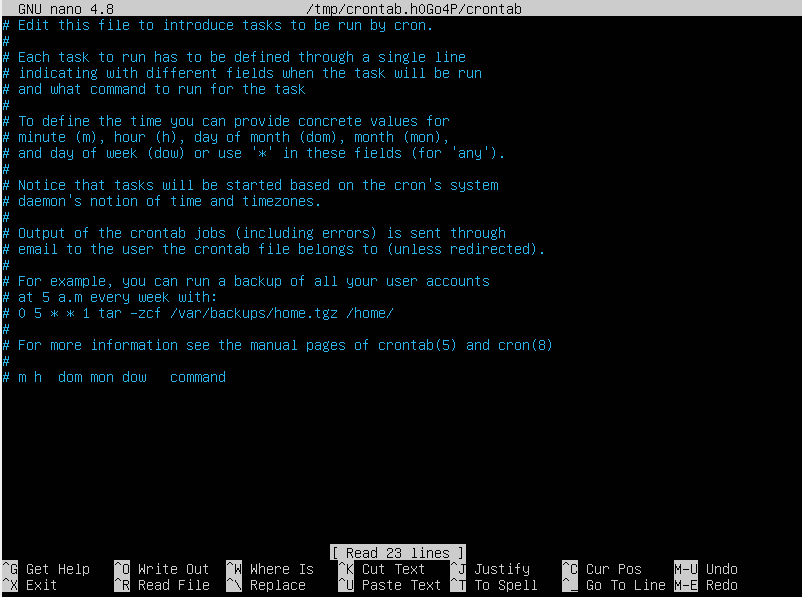

1. Используя планировщик заданий, запустим команду uptime через каждые 2 минуты.

```nano
*/2 * * * * uptime
```
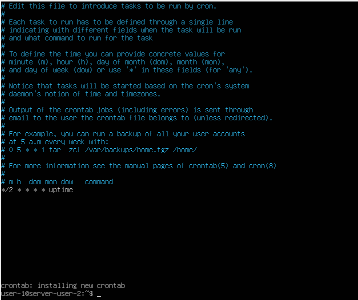

2. Найти в системных журналах строчки (минимум две в заданном временном диапазоне) о выполнении.
  
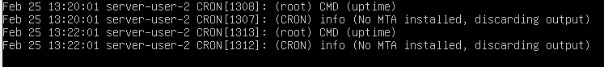

3. Вывести на экран список текущих заданий для CRON.
``` bash 
$ sudo crtontab -l
```

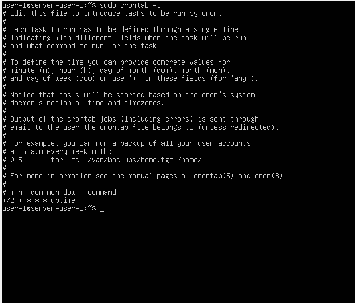

4. Удалить все задания из планировщика заданий.
``` bash 
$ sudo crtontab -r
$ sudo crtontab -l
```
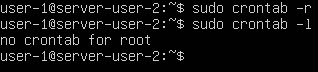